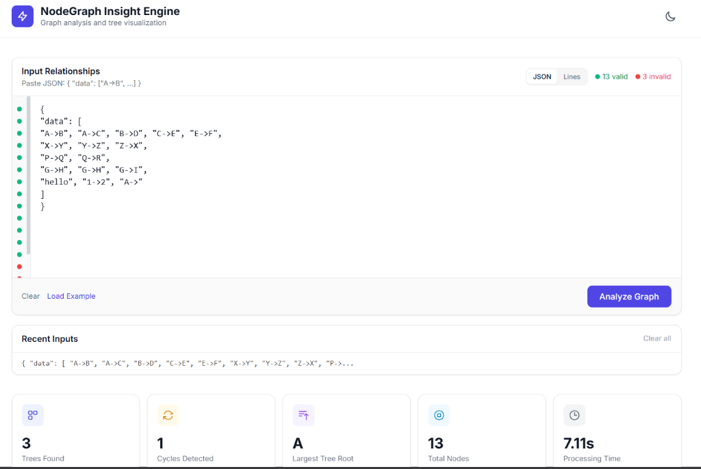
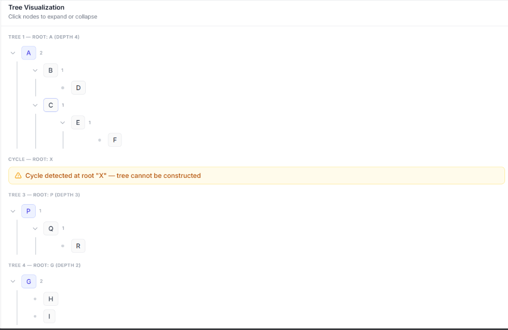
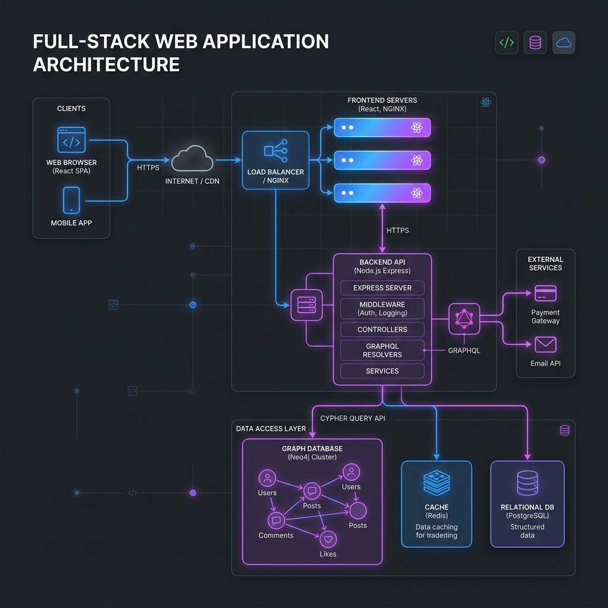

# NodeGraph Insight Engine

A full-stack web application that accepts hierarchical relationships in the format `X->Y`, validates them, constructs directed graph structures, detects cycles, and generates structured tree visualizations.

## Live Demo

- **Frontend URL**: [Insert Frontend URL here](https://your-frontend-url.com)
- **Backend API**: [Insert Backend URL here](https://your-backend-url.com)

## Screenshots

### Application Interface



### Architecture Diagram


## Architecture

```
backend/          Node.js + Express API
  ├── routes/         Route definitions
  ├── controllers/    Request orchestration
  ├── services/       Graph, tree, and cycle logic
  ├── models/         Graph data structure
  └── utils/          Validation and depth calculation

frontend/         React + Vite + Tailwind CSS
  ├── components/     Reusable UI components
  └── pages/          Page compositions
```

## API

### POST `/bfhl`

**Request:**
```json
{
  "data": ["A->B", "B->C", "B->D", "C->E"]
}
```

**Response:**
```json
{
  "is_success": true,
  "processing_time_ms": 1.75,
  "result": {
    "valid_edges": [["A","B"], ["B","C"]],
    "invalid_entries": [],
    "duplicate_edges": [],
    "trees": [{ "name": "A", "children": [...] }],
    "cycles_detected": [],
    "summary": {
      "total_trees": 1,
      "total_cycles": 0,
      "largest_tree_depth": 3,
      "total_nodes": 5,
      "total_valid_edges": 4
    }
  }
}
```

## Features

- Strict input validation with regex and duplicate detection
- Directed graph construction using adjacency lists
- DFS-based cycle detection with recursion stack tracking
- Recursive tree construction with cycle-safe traversal
- Collapsible tree visualization UI
- Real-time input validation preview
- Input history (last 5 submissions)
- JSON export / download
- Performance timer display
- Dark / Light theme toggle
- Responsive design

## Setup

### Backend
```bash
cd backend
npm install
npm run dev
```

### Frontend
```bash
cd frontend
npm install
npm run dev
```

## Tech Stack

- **Backend:** Node.js, Express, CORS
- **Frontend:** React, Vite, Tailwind CSS
- **Language:** ES6+ JavaScript
